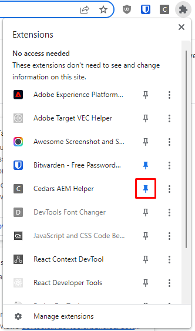

# Cedars AEM Chrome Extension

## Instructions

1. Download zip file and unpack
2. Go to chrome extensions menu (`chrome://extensions`)
3. Toggle **Developer Mode** and click **Load Unpacked**
4. Select unpacked folder

5. (Optional) Pin to your address bar if it doesn't automatically show up

## Usage

From any AEM page (editor, dispatcher, etc.), click on the appropriate button to navigate to that url.

### Examples

- Editor URL to Dispatcher URL
- Dispatcher URL to Editor Published URL (`wcmmode=disabled`)
- Editor Published URL to AEM URL (sites.html)

## Notes

- Works only for Dev and Stage
- Works only for pages under `cedars-sinai`. Using this on a root level page (far left column in AEM) will probably error out
